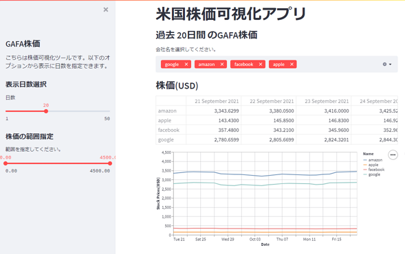
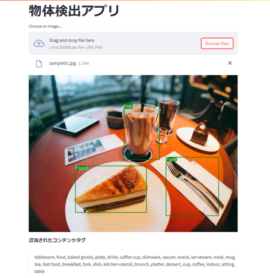

# Streamlit practice

udemyの成果物をまとめた内容である。

## gafa_finance(米国株価可視化アプリ)

yfinanceのパッケージを利用して株価データを取得して可視化する。

- パッケージインストール
```
pip install yfinance
```



## image_analysis(物体検出アプリ)

AzureのComputer Vision APIを利用してアップロードした画像ファイルの物体検出を行い、検出されたデータを画像ファイルに表示して、認識されたコンテンツタグを表示する。

- パッケージインストール
```
pip install --upgrade azure-cognitiveservices-vision-computervision
pip install pillow
```

- secret.json  
AzureのComputer Vision APIで発行した認証キーとENDPOINTをsecret.jsonファイルに記載する必要がある。
```
{
    "KEY": "YOUR KEY",
    "ENDPOINT": "YOUR ENDPOINT"
}
```



## youtube_search(YouTube分析アプリ)

apiclient.discoveryのパッケージでYoutubeのAPIを利用して検索クエリにヒットした動画情報を登録者数の上限値で絞って表示しる。
動画のIDを入力してビデオ再生すれば動画が再生される。

- パッケージインストール
```
pip install google-api-python-client
```

- secret.json  
Google Cloud Platform > APIとサービス > 認証情報 > 認証情報を作成 > APIキーで作成したAPIキーをsecret.jsonファイルに記載する必要がある。
```
{
    "KEY": "YOUR KEY"
}
```


## web_scraping(WEBスクレイピング活用アプリ)

BeautifulSoupのパッケージを利用してWEBサイトの情報をスクレイピングしてその情報を表示する。また、gspread, gspread_dataframeのパッケージを利用してGoogleスプレッドシートにデータを書き込むことができる。

- パッケージインストール
```
pip install beautifulsoup4
```

- secret.json  
Google Cloud Platform > APIとサービス > 認証情報 > 認証情報を作成 > サービスアカウントを選択して遷移されたページでサービスアカウント名を入力するとJSONファイルで認証情報ファイルがダウンロードされる。このファイルをディレクトリ内にコピーする必要がある。

